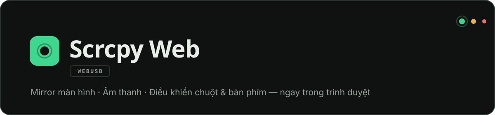

<div align="center">



**Điều khiển điện thoại Android trực tiếp từ trình duyệt — không cần cài phần mềm**

[](https://flutter.dev)
[](https://github.com/Genymobile/scrcpy)
[](https://developer.mozilla.org/docs/Web/API/WebUSB_API)
[](#giấy-phép)

</div>

---

| Trang chủ | Panel kết nối | Giao diện sáng |
|:---:|:---:|:---:|
|  |  |  |

Kết nối qua **WebUSB** (ADB over USB) · Mirror màn hình real-time · Âm thanh · Điều khiển chuột & bàn phím

## Tại sao Scrcpy Web?

scrcpy desktop mạnh nhưng phải cài đặt; Vysor phải trả phí cho chất lượng tốt. Scrcpy Web chạy thẳng trong tab trình duyệt: **cắm cáp là mirror** — không cài client, không driver, không tài khoản, mọi thư viện được bundle cục bộ (không phụ thuộc CDN lúc runtime).

## Tính năng

| | |
|---|---|
| **Đa thiết bị** | Kết nối nhiều điện thoại cùng lúc — mỗi thiết bị một tab, hiển thị cạnh nhau hoặc toàn màn hình |
| **Mirror real-time** | WebCodecs + WebGL giải mã H.264 / H.265 / AV1, tới 120 fps |
| **Âm thanh** | Truyền âm thanh điện thoại ra loa máy tính (Opus / AAC / Raw) |
| **Điều khiển chuột** | Click / kéo / cuộn; chuột phải = Back, chuột giữa = Home — giống scrcpy desktop |
| **Bàn phím PC → Android** | Gõ ký tự trực tiếp, phím điều hướng, Esc = Back |
| **Tắt màn hình điện thoại** | Điều khiển khi màn hình thật đã tắt — bật lại tự động khi ngắt kết nối |
| **Chụp màn hình** | Lưu khung hình gốc của điện thoại vào clipboard máy tính |
| **Cấu hình linh hoạt** | Độ phân giải, bitrate, FPS, codec, xoay màn hình, camera mirroring — tự lưu vào localStorage |
| **Clipboard sync** | Sao chép / dán hai chiều giữa máy tính và điện thoại |
| **Giao diện** | Dark / Light mode đồng bộ cả shell lẫn canvas, responsive |

## Bắt đầu nhanh

1. Mở ứng dụng trên trình duyệt **Chrome / Edge 81+**
2. Trên điện thoại: bật **Gỡ lỗi USB** (Cài đặt › Tuỳ chọn nhà phát triển)
3. Cắm cáp dữ liệu vào máy tính, nhấn **Kết nối thiết bị**
4. Chọn thiết bị trong hộp thoại quyền USB của trình duyệt
5. Xác nhận quyền gỡ lỗi trên màn hình điện thoại — bắt đầu điều khiển!

### Yêu cầu hệ thống

| Thành phần | Yêu cầu |
|---|---|
| Trình duyệt | Chrome 81+ hoặc Edge 81+ (hỗ trợ WebUSB) |
| Android | Đã bật **Gỡ lỗi USB (USB Debugging)** |
| Cáp | Dây USB hỗ trợ truyền dữ liệu (không phải cáp sạc thường) |
| Hosting | Trang phải chạy qua `https://` hoặc `localhost` (WebUSB yêu cầu secure context) |

### Cài đặt

```bash
git clone <repository-url>
cd scrcpy_web

flutter pub get
flutter run -d chrome
```

## Sử dụng

### Điều khiển bằng bàn phím & chuột

| Hành động | Cách thao tác |
|---|---|
| Back | Phím `Esc` hoặc **chuột phải** trên canvas |
| Home | **Chuột giữa** trên canvas |
| Gõ văn bản | Gõ trực tiếp khi canvas đang focus |
| Cuộn | Con lăn chuột |
| Chụp màn hình | Nút **Chụp màn hình** góc phải canvas → ảnh vào clipboard máy tính |

> **Thêm thiết bị khác:** nhấn **Kết nối thiết bị** trên thanh app để mở tab mới.
> Từ 2 thiết bị, các màn hình tự chia cột hiển thị cạnh nhau; dock dưới điều khiển đúng thiết bị của từng cột.
> **Ngắt kết nối:** nút **Ngắt kết nối** trên dock hoặc **✕ Ngắt kết nối** góc phải canvas.

## Kiến trúc

```
Trình duyệt (Chrome / Edge 81+)
│
├─ Flutter shell ── top bar · tab thiết bị · dock điều khiển
│        ▲
│        │ postMessage (same-origin, kiểm tra origin hai chiều)
│        ▼
├─ iframe scrcpy_frame.html  ← mỗi thiết bị MỘT iframe độc lập
│        │                      (không bao giờ bị tháo/gắn lại khi
│        │                       chuyển tab hay đổi bố cục)
│        │ WebUSB — ADB over USB
│        ▼
└─ Điện thoại Android ── adbd ⇄ scrcpy-server 3.3.3
```

Mỗi phiên kết nối là một iframe riêng, nhờ đó **nhiều điện thoại chạy song song** mà không rớt kết nối khi chuyển đổi bố cục — Flutter chỉ điều khiển layout qua CSS class trên container dùng chung.

<details>
<summary><b>Cấu trúc dự án</b></summary>

```
lib/
├── main.dart                              # Entry point
├── theme/app_theme.dart                   # Token thiết kế: màu, font, ThemeData
├── models/
│   ├── scrcpy_options.dart                # Model tùy chọn scrcpy
│   └── scrcpy_state.dart                  # Enum trạng thái kết nối
├── services/
│   ├── scrcpy_service.dart                # Interface ScrcpySession + ScrcpyService
│   ├── scrcpy_web_service.dart            # Web impl: nhiều phiên, mỗi phiên 1 iframe
│   └── scrcpy_service_stub.dart           # Stub cho nền tảng khác web
├── viewmodels/
│   ├── scrcpy_sessions_view_model.dart    # Quản lý danh sách phiên (đa thiết bị)
│   └── theme_controller.dart              # Dark / Light mode
└── widgets/
    ├── scrcpy_web_widget.dart             # Shell: top bar + tab + stage + dock
    ├── deck_widgets.dart                  # SignalDot, tab, chip trạng thái, brand
    └── empty_state_hero.dart              # Trang rỗng hướng dẫn 3 bước

web/
├── index.html                             # HTML entry point
├── scrcpy_frame.html                      # Logic WebUSB/scrcpy (JS) — mỗi iframe 1 phiên
├── fonts/                                 # Space Grotesk · Inter · JetBrains Mono
├── vendor/scrcpy_bundle.js                # Bundle @yume-chan build bằng esbuild
└── scrcpy-server.jar                      # Server scrcpy chạy trên điện thoại

tools/jsbundle/                            # Nguồn bundle vendor (npm + esbuild)
assets/fonts/                              # Bản font dùng bởi Flutter (khớp web/fonts)
```

</details>

<details>
<summary><b>Giao tiếp Flutter ↔ iframe</b></summary>

| Hướng | Kênh | Nội dung |
|---|---|---|
| Flutter → iframe | `postMessage` vào `contentWindow` (targetOrigin = origin hiện tại) | `{type: "keyEvent", key}` · `{type: "disconnect"}` · `{type: "theme", mode}` |
| iframe → Flutter | `window.parent.postMessage` (targetOrigin = origin hiện tại) | `{type: "scrcpyState", state}` |

Các nút Back/Home/Apps ở dock chỉ tác động lên phiên của vùng tương ứng; bàn phím/chuột tác động lên iframe đang focus.

</details>

## Tham chiếu tùy chọn scrcpy

Tùy chỉnh trong **panel kết nối** trước khi bấm Kết nối; mọi thay đổi tự lưu vào `localStorage` (khóa `scrcpy_options`).

| Nhóm | Tùy chọn | Giá trị | Mặc định |
|---|---|---|---|
| **Video** | Bật video | bật / tắt | bật |
| | Độ phân giải | Mặc định · Theo thiết bị · Tùy chỉnh | Mặc định |
| | Kích thước tùy chỉnh | Rộng × Cao (px) | 1080 × 1920 |
| | Video bitrate | ví dụ `8 Mbps` | 8 Mbps |
| | Video codec | H.264 · H.265 · AV1 | H.264 |
| | FPS tối đa | 0–120 (0 = không giới hạn) | Không giới hạn |
| **Âm thanh** | Bật âm thanh | bật / tắt | bật |
| | Audio codec | Opus · AAC · Raw | Opus |
| | Audio bitrate | ví dụ `128 kbps` | 128 kbps |
| | Nguồn âm thanh | Loa · Playback · Mic (không xử lý) · Mic (camcorder) · Mic (giao tiếp)… | Loa |
| **Màn hình** | Điều khiển | chuột/bàn phím | bật |
| | Clipboard sync | hai chiều máy ⇄ điện thoại | bật |
| | Giữ màn hình sáng | ngăn điện thoại tắt màn khi kết nối | tắt |
| | Hiển thị điểm chạm | tiện khi ghi màn hình | tắt |
| | Xoay màn hình | 0° · 90° · 180° · 270° | 0° |
| | Tắt màn hình điện thoại | điều khiển khi màn hình thật tắt | tắt |
| **Camera** | Camera mirroring | hiển thị camera sau trên máy tính | tắt |

## Phát triển

```bash
# Chạy dev server
flutter run -d chrome

# Build release cho web (kèm wasm dry-run)
flutter build web --release

# Chạy tất cả tests
flutter test

# Phân tích tĩnh
flutter analyze
```

<details>
<summary><b>Build lại bundle JavaScript vendor</b></summary>

Các thư viện JavaScript được **bundle cục bộ** thành một file duy nhất
`web/vendor/scrcpy_bundle.js` (không phụ thuộc CDN lúc runtime):

| Package | Vai trò |
|---|---|
| `@yume-chan/adb` | ADB over WebUSB |
| `@yume-chan/adb-daemon-webusb` | Transport USB |
| `@yume-chan/adb-credential-web` | Lưu credential ADB |
| `@yume-chan/scrcpy` · `@yume-chan/adb-scrcpy` | Giao thức scrcpy |
| `@yume-chan/scrcpy-decoder-webcodecs` | Giải mã video (WebCodecs/WebGL) |

Bundle được build bằng esbuild để **dedupe dependency** — mọi package chia sẻ chung
một instance. Khi cần nâng cấp thư viện:

```bash
cd tools/jsbundle
# sửa version trong package.json nếu muốn
npm install
npm run build
```

</details>

<details>
<summary><b>Nâng cấp scrcpy-server</b></summary>

File `web/scrcpy-server.jar` phải tương thích với cấu hình giao thức trong
`web/scrcpy_frame.html`:

| Thành phần | Phiên bản |
|---|---|
| `scrcpy-server.jar` | **3.3.3** |
| Options class | `AdbScrcpyOptions3_3_3` (`version: "3.3.3"`) |

Nếu thay đổi server jar, hãy cập nhật class options tương ứng
(`AdbScrcpyOptions2_x`, `AdbScrcpyOptions3_x`...) trong `scrcpy_frame.html`.
Server jar tải về từ [scrcpy releases](https://github.com/Genymobile/scrcpy/releases).

</details>

## Xử lý sự cố

<details>
<summary><b>"The device is already in use by another program" / kết nối lại không được</b></summary>

Một tiến trình `adb.exe` (ADB server) trên máy tính — thường do **Android Studio**,
**VS Code extension** hoặc **scrcpy desktop** tự khởi động — đang chiếm độc quyền
giao diện USB của điện thoại, nên trình duyệt không thể chiếm.

```bash
# Nhả USB interface trên máy tính
adb kill-server
```

Hoặc đóng Android Studio / IDE đang chạy adb. Để hạn chế tái diễn:

- Đóng các IDE trước khi dùng ứng dụng web
- Tạo shortcut một cú bấm cho lệnh `adb kill-server` nếu hay cần
- Gỡ `platform-tools` nếu không cần adb trên desktop

Ứng dụng đã tự động xử lý: reset thiết bị USB trước khi kết nối, thử bắt tay ADB
tối đa 3 lần, và phát hiện chính xác tình trạng bị chiếm USB để hiển thị hướng dẫn.

</details>

<details>
<summary><b>Các lỗi thường gặp khác</b></summary>

| Hiện tượng | Nguyên nhân & cách xử lý |
|---|---|
| Không thấy thiết bị trong hộp thoại chọn | Bật *Gỡ lỗi USB* trên điện thoại; dùng cáp hỗ trợ truyền dữ liệu |
| Trang không mở được WebUSB | Phải chạy qua `https://` hoặc `localhost` (secure context) |
| Timeout khi khởi động gương | Phiên bản `scrcpy-server.jar` phải khớp cấu hình giao thức — xem phần trên |
| Không ghi được ảnh chụp vào clipboard | Trang cần đang được focus; nhấn lại nút sau khi click vào trang |
| Không nghe được âm thanh | Thiết bị phải hỗ trợ; kiểm tra tùy chọn codec âm thanh (Opus/AAC) |

</details>

## Thiết kế giao diện

Giao diện theo ngôn ngữ thiết kế **"Bàn điều khiển"**: nền graphite tối, accent
xanh bạc hà chỉ dùng cho những gì đang *sống* (thiết bị đã kết nối, hành động
chính), thông số kỹ thuật hiển thị bằng mono. Toàn bộ token nằm trong
[`lib/theme/app_theme.dart`](lib/theme/app_theme.dart).

| Token | Giá trị | Vai trò |
|---|---|---|
| Nền | `#0F1211` / `#161B19` | Nền trang / bề mặt khối |
| Chữ | `#EAEEEB` / `#9BA59E` | Chính / phụ |
| Accent | `#3FD68F` | Tín hiệu sống: kết nối, nút chính |
| Cảnh báo | `#E8B44A` · `#F0716C` | Đang kết nối · Lỗi |
| Hiển thị | Space Grotesk | Wordmark, tiêu đề |
| Thân bài | Inter | Label, nội dung |
| Kỹ thuật | JetBrains Mono | Trạng thái, thông số, nhãn mục |

Motif nhận diện: **signal dot** — chấm trạng thái phát sáng lặp ở tab thiết bị,
chip trạng thái và dock; nhịp pulse khi đang kết nối (tự tắt khi hệ điều hành
bật giảm chuyển động).

## Giấy phép

[MIT](LICENSE)

## Credits

- [scrcpy](https://github.com/Genymobile/scrcpy) — Dự án gốc
- [ya-webadb (@yume-chan)](https://github.com/yume-chan/ya-webadb) — Thư viện WebUSB/scrcpy cho web
