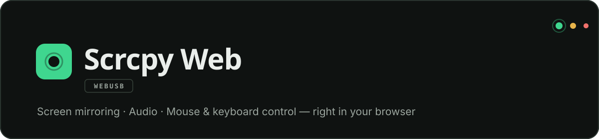
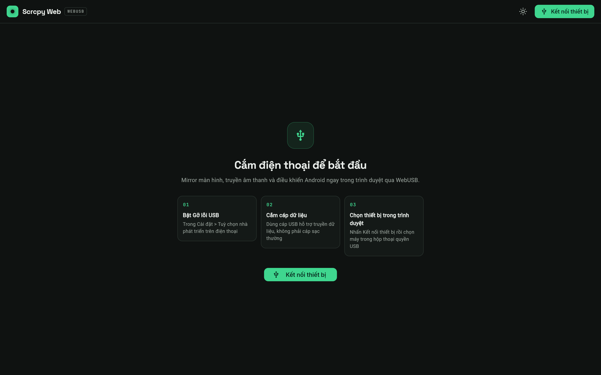
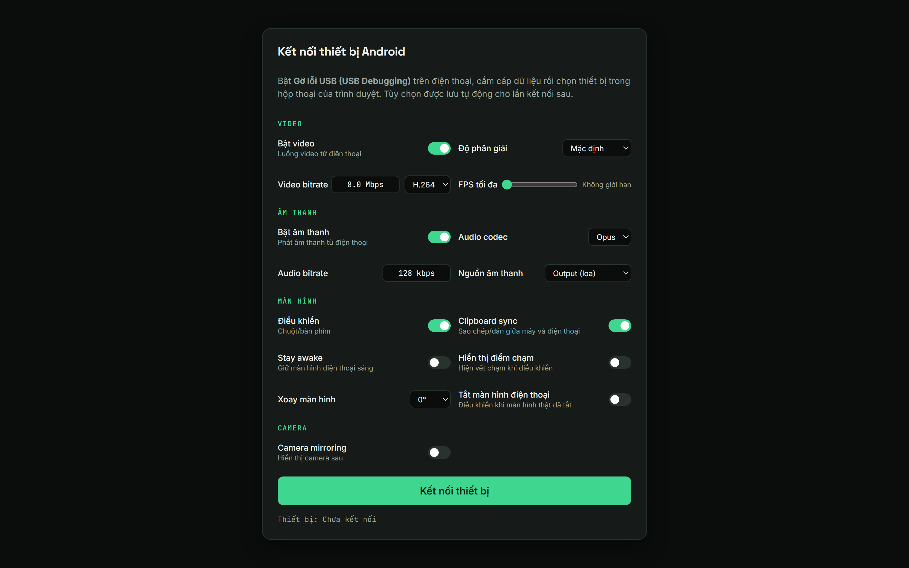
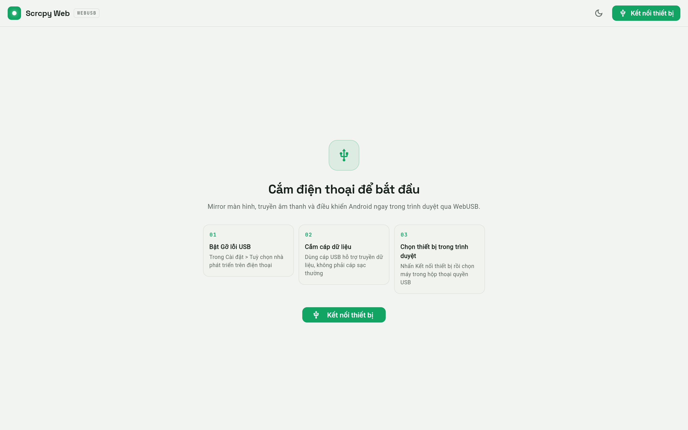

<div align="center">



**Control your Android phone straight from the browser — no installs required**

English · [Tiếng Việt](README.vi.md)

[](https://flutter.dev)
[](https://github.com/Genymobile/scrcpy)
[](https://developer.mozilla.org/docs/Web/API/WebUSB_API)
[](#license)

</div>

---

| Home | Connect panel | Light mode |
|:---:|:---:|:---:|
|  |  |  |

Connects over **WebUSB** (ADB over USB) · Real-time screen mirroring · Audio forwarding · Mouse & keyboard control

> **Note:** the in-app interface is Vietnamese-first. The app itself is fully usable regardless — the connect flow is three clicks.

## Why Scrcpy Web?

Desktop scrcpy is powerful but requires an install; Vysor charges for decent quality. Scrcpy Web runs in a browser tab: **plug in a cable and start mirroring** — no client to install, no drivers, no accounts, and all libraries are bundled locally (zero CDN dependency at runtime).

## Features

| | |
|---|---|
| **Multi-device** | Connect several phones at once — one tab per device, view side-by-side or full screen |
| **Real-time mirroring** | WebCodecs + WebGL decoding for H.264 / H.265 / AV1, up to 120 fps |
| **Audio** | Forward phone audio to your computer speakers (Opus / AAC / Raw) |
| **Mouse control** | Click / drag / scroll; right-click = Back, middle-click = Home — same as scrcpy desktop |
| **PC keyboard → Android** | Type directly, navigation keys, Esc = Back |
| **Turn off the phone screen** | Keep controlling while the physical screen is off — it turns back on automatically on disconnect |
| **Screenshots** | Save the phone's original-resolution frame to your computer's clipboard |
| **Flexible configuration** | Resolution, bitrate, FPS, codec, rotation, camera mirroring — saved to localStorage automatically |
| **Clipboard sync** | Two-way copy/paste between computer and phone |
| **Interface** | Dark / Light mode synced across shell and canvas, responsive |

## Quick start

1. Open the app in **Chrome / Edge 81+**
2. On the phone: enable **USB debugging** (Settings › Developer options)
3. Connect a data cable to your computer and press **Connect device**
4. Pick the device in the browser's USB permission dialog
5. Confirm the debugging prompt on the phone — start controlling!

### Requirements

| Component | Requirement |
|---|---|
| Browser | Chrome 81+ or Edge 81+ (WebUSB support) |
| Android | **USB Debugging** enabled |
| Cable | A data-capable USB cable (not a charge-only cable) |
| Hosting | The page must be served over `https://` or `localhost` (WebUSB requires a secure context) |

### Setup

```bash
git clone <repository-url>
cd scrcpy_web

flutter pub get
flutter run -d chrome
```

## Usage

### Keyboard & mouse control

| Action | How |
|---|---|
| Back | `Esc` key or **right-click** on the canvas |
| Home | **Middle-click** on the canvas |
| Type text | Type directly while the canvas has focus |
| Scroll | Mouse wheel |
| Screenshot | **Screenshot** button at the canvas top-right → image goes to your computer's clipboard |

> **Add another device:** press **Connect device** in the top bar to open a new tab.
> With 2+ devices, screens are automatically split into columns; each dock section below controls the device in its column.
> **Disconnect:** the **Disconnect** button in the dock or **✕ Disconnect** at the canvas top-right.

## Architecture

```
Browser (Chrome / Edge 81+)
│
├─ Flutter shell ── top bar · device tabs · control dock
│        ▲
│        │ postMessage (same-origin, verified in both directions)
│        ▼
├─ iframe scrcpy_frame.html  ← ONE iframe per device
│        │                      (never re-attached when switching
│        │                       tabs or layouts)
│        │ WebUSB — ADB over USB
│        ▼
└─ Android phone ── adbd ⇄ scrcpy-server 3.3.3
```

Each session is an independent iframe, so **multiple phones run in parallel** without dropping connections when layouts change — Flutter only controls layout through CSS classes on a shared container.

<details>
<summary><b>Project structure</b></summary>

```
lib/
├── main.dart                              # Entry point
├── theme/app_theme.dart                   # Design tokens: colors, fonts, ThemeData
├── models/
│   ├── scrcpy_options.dart                # scrcpy options model
│   └── scrcpy_state.dart                  # Connection state enum
├── services/
│   ├── scrcpy_service.dart                # ScrcpySession + ScrcpyService interfaces
│   ├── scrcpy_web_service.dart            # Web impl: one iframe per session
│   └── scrcpy_service_stub.dart           # Stub for non-web platforms
├── viewmodels/
│   ├── scrcpy_sessions_view_model.dart    # Session list management (multi-device)
│   └── theme_controller.dart              # Dark / Light mode
└── widgets/
    ├── scrcpy_web_widget.dart             # Shell: top bar + tabs + stage + dock
    ├── deck_widgets.dart                  # SignalDot, tabs, status chip, brand
    └── empty_state_hero.dart              # Empty state with a 3-step guide

web/
├── index.html                             # HTML entry point
├── scrcpy_frame.html                      # WebUSB/scrcpy logic (JS) — one per iframe
├── fonts/                                 # Space Grotesk · Inter · JetBrains Mono
├── vendor/scrcpy_bundle.js                # Bundled @yume-chan (esbuild)
└── scrcpy-server.jar                      # scrcpy server running on the phone

tools/jsbundle/                            # Vendor bundle source (npm + esbuild)
assets/fonts/                              # Fonts used by Flutter (matches web/fonts)
```

</details>

<details>
<summary><b>Flutter ↔ iframe communication</b></summary>

| Direction | Channel | Payload |
|---|---|---|
| Flutter → iframe | `postMessage` into `contentWindow` (targetOrigin = current origin) | `{type: "keyEvent", key}` · `{type: "disconnect"}` · `{type: "theme", mode}` |
| iframe → Flutter | `window.parent.postMessage` (targetOrigin = current origin) | `{type: "scrcpyState", state}` |

The Back/Home/Apps buttons in the dock only affect the session of their own region; keyboard and mouse go to the focused iframe.

</details>

## scrcpy options reference

Configure in the **connect panel** before pressing Connect; every change is saved to `localStorage` (key `scrcpy_options`).

| Group | Option | Values | Default |
|---|---|---|---|
| **Video** | Enable video | on / off | on |
| | Resolution | Default (1600) · Device (native) · Custom | Default (1600) |
| | Custom size | Width × Height (px) | 1080 × 1920 |
| | Video bitrate | e.g. `8 Mbps` | 8 Mbps |
| | Video codec | H.264 · H.265 · AV1 | H.264 |
| | Max FPS | 0–120 (0 = unlimited) | Unlimited |
| **Audio** | Enable audio | on / off | on |
| | Audio codec | Opus · AAC · Raw | Opus |
| | Audio bitrate | e.g. `128 kbps` | 128 kbps |
| | Audio source | Speaker output · Playback · Mic (unprocessed) · Mic (camcorder) · Mic (voice comm)… | Speaker output |
| **Screen** | Control | mouse / keyboard | on |
| | Clipboard sync | two-way computer ⇄ phone | on |
| | Stay awake | keep the phone screen on while connected | off |
| | Show touches | handy for screen recording | off |
| | Rotation | 0° · 90° · 180° · 270° | 0° |
| | Turn off phone screen | control while the physical screen is off | off |
| **Camera** | Camera mirroring | show the rear camera on your computer | off |

## Development

```bash
# Dev server
flutter run -d chrome

# Release build for web (includes wasm dry-run)
flutter build web --release

# Run all tests
flutter test

# Static analysis
flutter analyze
```

<details>
<summary><b>Rebuild the vendor JavaScript bundle</b></summary>

JavaScript libraries are **bundled locally** into a single file,
`web/vendor/scrcpy_bundle.js` (no CDN dependency at runtime):

| Package | Role |
|---|---|
| `@yume-chan/adb` | ADB over WebUSB |
| `@yume-chan/adb-daemon-webusb` | USB transport |
| `@yume-chan/adb-credential-web` | ADB credential store |
| `@yume-chan/scrcpy` · `@yume-chan/adb-scrcpy` | scrcpy protocol |
| `@yume-chan/scrcpy-decoder-webcodecs` | Video decoding (WebCodecs/WebGL) |

The bundle is built with esbuild for **dependency deduplication** — every package
shares one instance. To upgrade the libraries:

```bash
cd tools/jsbundle
# bump versions in package.json if needed
npm install
npm run build
```

</details>

<details>
<summary><b>Upgrading scrcpy-server</b></summary>

`web/scrcpy-server.jar` must match the protocol configuration in
`web/scrcpy_frame.html`:

| Component | Version |
|---|---|
| `scrcpy-server.jar` | **3.3.3** |
| Options class | `AdbScrcpyOptions3_3_3` (`version: "3.3.3"`) |

If you change the server jar, update the matching options class
(`AdbScrcpyOptions2_x`, `AdbScrcpyOptions3_x`...) in `scrcpy_frame.html`.
Download the server jar from [scrcpy releases](https://github.com/Genymobile/scrcpy/releases).

</details>

## Troubleshooting

<details>
<summary><b>"The device is already in use by another program" / can't reconnect</b></summary>

An `adb.exe` process (ADB server) on your computer — usually started by
**Android Studio**, a **VS Code extension**, or **desktop scrcpy** — holds the
phone's USB interface exclusively, so the browser can't claim it.

```bash
# Release the USB interface on your computer
adb kill-server
```

Or close Android Studio / any IDE running adb. To avoid recurrence:

- Close IDEs before using the web app
- Create a one-click shortcut for `adb kill-server` if this happens often
- Remove `platform-tools` if you don't need desktop adb

The app already handles this automatically: it resets the USB device before
connecting, retries the ADB handshake up to 3 times, and detects the
"interface in use" condition to show guidance.

</details>

<details>
<summary><b>Other common issues</b></summary>

| Symptom | Cause & fix |
|---|---|
| Device doesn't appear in the picker | Enable *USB debugging* on the phone; use a data-capable cable |
| WebUSB unavailable | The page must be served over `https://` or `localhost` (secure context) |
| Timeout when starting the mirror | `scrcpy-server.jar` version must match the protocol config — see above |
| Screenshot not saved to clipboard | The page needs focus; click the page, then press the button again |
| No audio | The device must support it; check the audio codec option (Opus/AAC) |

</details>

## UI design

The interface follows a **"control deck"** design language: a dark graphite
base, a mint accent reserved for things that are *alive* (connected devices,
primary actions), and technical readouts set in a mono face. All tokens live in
[`lib/theme/app_theme.dart`](lib/theme/app_theme.dart).

| Token | Value | Role |
|---|---|---|
| Background | `#0F1211` / `#161B19` | Page / surface |
| Text | `#EAEEEB` / `#9BA59E` | Primary / secondary |
| Accent | `#3FD68F` | Live signal: connected, primary actions |
| Warning | `#E8B44A` · `#F0716C` | Connecting · Error |
| Display | Space Grotesk | Wordmark, headings |
| Body | Inter | Labels, content |
| Technical | JetBrains Mono | Status, readouts, section labels |

Signature motif: the **signal dot** — a glowing status dot repeated across
device tabs, the status chip, and the dock; it pulses while connecting
(animation disabled automatically when the OS prefers reduced motion).

## License

[MIT](LICENSE)

## Credits

- [scrcpy](https://github.com/Genymobile/scrcpy) — The original project
- [ya-webadb (@yume-chan)](https://github.com/yume-chan/ya-webadb) — WebUSB/scrcpy library for the web
